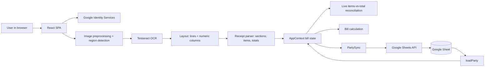
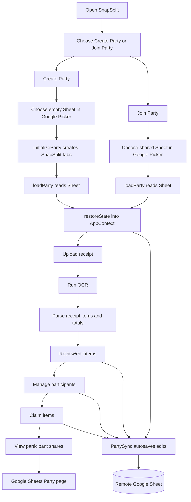
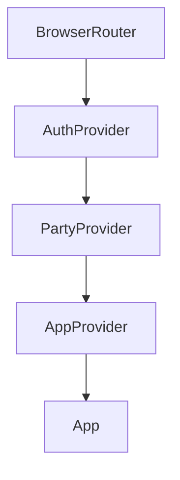
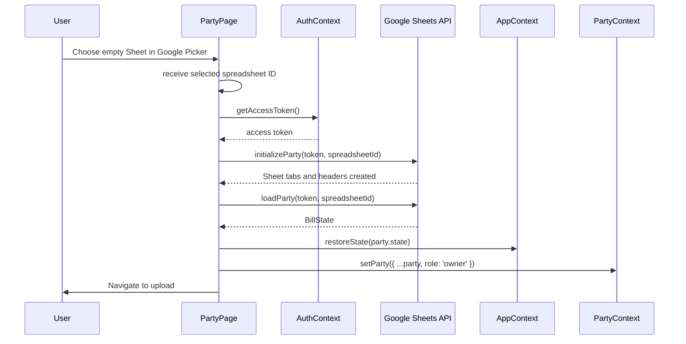
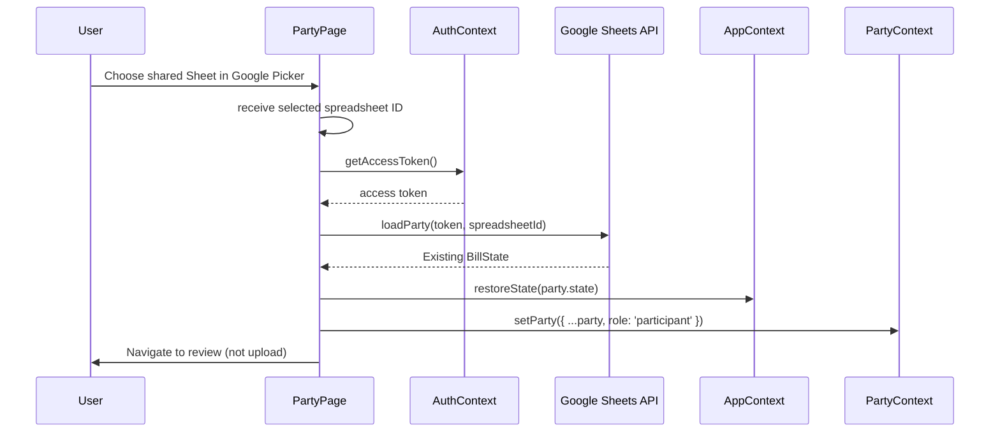
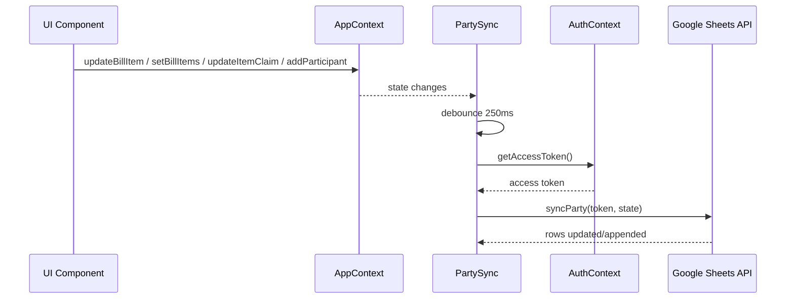
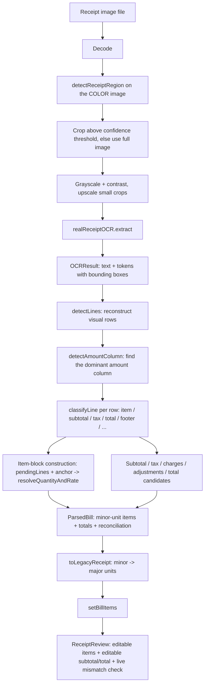

# SnapSplit Application Documentation

SnapSplit is a backendless React + TypeScript web app for splitting a restaurant receipt. The app runs entirely in the browser and uses a user-owned Google Sheet as the shared party state.

The current implementation is intentionally small: one bill, one shared Google Sheet, browser-local state while the app is open, and row-level persistence to Google Sheets.

## 1. High-Level Architecture



There is no SnapSplit backend. Google provides persistence and per-file authorization:

- Google OAuth grants SnapSplit access only to Google Sheets selected through Google Picker.
- Google Sheets stores the party data.
- React context stores the live in-browser bill state.
- `PartySync` watches local state and writes changes back to the remote Sheet.

## 2. Current Product Flow



The party screen appears before receipt upload. Each user must select the shared Sheet in Google Picker. This establishes per-file access under the `drive.file` scope; bill edits made after that point can be saved to the party Sheet.

**Role gates Upload.** Creating a party sets `role: 'owner'`; joining an existing one sets `role: 'participant'` (see `Party` in [party.ts](../src/google/party.ts)). Only an owner sees the Upload link and lands on the upload screen at `/`; a participant lands on Review instead, since the owner's receipt already exists there and a participant re-uploading would silently overwrite the shared bill via `PartySync`. This is a client-side UI hint only — it is never written to the Sheet, and Drive/Sheets sharing permissions remain the actual access control.

The Review step is where the user corrects OCR mistakes: item names, quantities, and unit prices are editable inline, and the receipt's own subtotal/total are now also directly editable (see §8, `checkItemsAgainstReceiptTotal`) rather than being a fixed, un-correctable value carried over from OCR.

## 3. State Model

The main app state is `BillState` from `src/bill/models.ts`.

```ts
type BillState = {
  receiptItems: BillItem[];
  receiptSubtotal?: number;
  receiptTotal?: number;
  participants: Participant[];
  itemClaims: ItemClaim[];
};
```

Important domain types:

- `BillItem`: one receipt line item with `id`, `name`, `quantity`, `unitPrice`, and `totalPrice`.
- `Participant`: one person in the bill with `id` and `name`.
- `ItemClaim`: how an item is assigned, either individually by quantity or shared equally among selected participants.
- `BillCalculationResult`: calculated totals, tax, participant summaries, and settlement lines.

## 4. Google Sheet Data Model

A SnapSplit party is represented by one Google spreadsheet with four tabs:

| Tab | Purpose | Columns |
| --- | --- | --- |
| `META` | Schema and party metadata | `key`, `value` |
| `USERS` | Participants | `user_id`, `name` |
| `ITEMS` | Receipt items | `item_id`, `name`, `quantity`, `unit_price`, `total_price` |
| `CLAIMS` | Item claims | `item_id`, `user_id`, `quantity`, `mode` |

The current schema version is `1`, stored in `META` as:

```text
schema_version | 1
currency       | INR
created_at     | ISO timestamp
```

The spreadsheet ID comes from a Google Sheets URL like:

```text
https://docs.google.com/spreadsheets/d/<spreadsheet-id>/...
```

## 5. Authentication and Authorization

Authentication code lives in `src/google/auth.ts`.

The browser OAuth client ID is hardcoded in `src/google/auth.ts`:

```ts
export const GOOGLE_CLIENT_ID = '<public OAuth client ID>';
```

Only a public OAuth client ID is used. There is no client secret in the browser app.

The app requests this least-privilege Drive scope:

```text
https://www.googleapis.com/auth/drive.file
```

`drive.file` grants access only to files the user selects through Google Picker or creates with SnapSplit. SnapSplit does not receive access to the user's other Sheets or Drive files.

Google Picker also requires the Google Picker API and Google Sheets API to be enabled, a browser API key restricted to SnapSplit's origins, and the Cloud project number as the Picker app ID.

Google Sheet sharing is not managed by SnapSplit. The party owner should share the Sheet with friends as Editors, or use link sharing if appropriate. Each friend must open SnapSplit, choose **Choose Google Sheet**, and select that same Sheet. A link-only Sheet may not appear in Picker until it is shared directly or added to the user's Drive.

### Account selection

`requestGoogleAccessToken()` explicitly passes `prompt: 'select_account'` to `requestAccessToken()`. Without it, Google's token client silently reuses whichever account already has a session in the browser, with no way to switch — a real problem for this app specifically, since there is no separate SnapSplit session and every distinct Google identity interaction (the party owner creating a Sheet, or a participant signing in independently) should let the person confirm which account they mean, rather than an app-level "current user" being assumed for them.

Note that `AuthContext.getAccessToken()` caches the resulting token in React state for the lifetime of the page load. The account picker only has a chance to run again once that cache is empty — a fresh page load, or after `signOut()`. Repeated Google-auth actions within the same loaded page (e.g. testing "switch account" without reloading) will keep reusing the first token obtained.

### Troubleshooting: `Error 400: origin_mismatch`

This means Google's OAuth server rejected the request because the browser's current origin (scheme + host + port) is not in the **Authorized JavaScript origins** list configured for `GOOGLE_CLIENT_ID` in Google Cloud Console (APIs & Services → Credentials). This check happens before any account picker is shown, so it can look like "no picker appears" even in incognito. Fix it in Cloud Console, not in code:

- Add the exact origin shown in the browser's address bar — no trailing slash, no path.
- Google treats `localhost`, `127.0.0.1`, and a LAN IP as three different origins, even on the same machine. Since [`vite.config.ts`](../vite.config.ts) binds to `0.0.0.0`, confirm which one the browser is actually using.
- Changes usually take effect within a few minutes.

This is a Google Cloud project setting, not something the app's source code can work around.

## 6. Module Map

```text
src/
  App.tsx                    Route shell, navigation, and party gate
  main.tsx                   React bootstrap and provider composition

  context/
    AppContext.tsx           Live bill state and state mutation functions (items, totals, participants, claims)
    AuthContext.tsx          Google OAuth token access
    PartyContext.tsx         Current connected Sheet-backed party

  google/
    auth.ts                  Google Identity Services and OAuth token handling
    party.ts                 Sheet schema, load, initialize, and sync operations; Party.role (client-side only, see §2)

  receipt/
    models.ts                Receipt, OCR, RgbaImage, and bill item types
    pipeline.ts              inferReceiptBill: image -> OCR -> ParsedBill, the canonical entry point
    ocr.ts                   Tesseract OCR implementation (realReceiptOCR)
    tesseractTokens.ts       Shared Tesseract-word -> OCRToken mapping (browser + Node harness)
    parser.ts                Thin legacy adapter: ParsedBill -> major-unit BillItem[] for the UI

    image/                   Deterministic, non-ML image preprocessing (spec-mandated: no LLM/VLM/cloud OCR)
      settings.ts              Single source of truth for preprocessing options (shared by browser + Node tests)
      decode.ts                Browser image decoder (canvas); Node has its own test-only decoder
      resize.ts                Pure-JS box-filter resize, used by both browser and Node so pixels match exactly
      preprocess.ts            Decode -> resize -> grayscale/contrast
      receiptDetector.ts       Finds the receipt as a bright, low-saturation, roughly solid region (on the COLOR image)
      crop.ts                  Crops RgbaImage to a detected region; encodes to PNG for the OCR engine
      normalize.ts             Orchestrates detect -> crop -> preprocess for one receipt image
      illumination.ts          Flat-field/shadow correction (true sliding-window box blur) -- implemented and
                                 empirically swept against all four real photos, but disabled by default: no tested
                                 configuration beat "off" without regressing at least one other receipt (see §8)
      perspective.ts           Perspective correction for a detected quadrilateral -- unused: nothing currently
                                 produces a quadrilateral to feed it (dead code, kept for a future pass)

    layout/                  Reconstructs spatial structure from OCR tokens
      lineDetection.ts         Groups tokens into visual lines by vertical position
      columnDetection.ts       Clusters numeric tokens into columns; identifies the dominant "amount" column
      normalizeTokens.ts       Token/bounding-box normalization helpers

    parsing/                 Deterministic classification and item/total extraction
      numberParser.ts          parseMoney (context-sensitive OCR digit correction) and parseQuantity
      keywordMatcher.ts        Summary keyword table, receipt-metadata detection, item-header detection
      sectionClassifier.ts     Classifies each line: item / subtotal / tax / total / footer / etc.
      receiptParser.ts         The real parser: parseReceipt(OCRResult) -> ParsedBill

  bill/
    models.ts                Bill, participant, claim, settlement types; BillCalculationResult.itemsNeedingReview
    claims.ts                Claim helpers and default claim construction
    splitting.ts             Item splitting helpers, including capIndividualQuantities (over-claim capping)
    settlement.ts            Per-participant bill calculation; flags over-claimed items for review
    reconciliation.ts        checkItemsAgainstReceiptTotal: live items-vs-receipt-total + totalBelowSubtotal check for Review

  routes/
    PartyPage.tsx            Create/join/refresh party screen
    ReceiptUploadPage.tsx    Route wrapper for receipt upload
    ReceiptReviewPage.tsx    Route wrapper for receipt review
    ParticipantsPage.tsx     Route wrapper for participant management
    ItemClaimPage.tsx        Route wrapper for item claiming
    SettlementPage.tsx       Route wrapper for bill result
    SheetExportPage.tsx      Route wrapper for Sheet status

  components/
    PartySync.tsx            Debounced autosync from AppContext to Google Sheet
    ReceiptUpload.tsx        Upload image, run inferReceiptBill, convert via toLegacyReceipt
    ReceiptReview.tsx        Edit parsed items and receipt subtotal/total; shows live mismatch and totalBelowSubtotal warnings
    Participants.tsx         Add/remove people
    ItemClaim.tsx            Individual/shared item claiming UI
    Settlement.tsx           Show calculated participant shares; warns when itemsNeedingReview is non-empty
    SheetExport.tsx          Show current Google Sheet party connection

  tests/
    *.test.ts                Unit tests for parsing, claims, splitting, settlement, reconciliation
    receipt/
      parsing/               Number parsing, section classification, item/quantity/total edge cases
      layout/                Line reconstruction and column detection
      image/                 Region detection (synthetic RgbaImage fixtures)
      support/               Node-only OCR/image test harness (never bundled into the app)
      fixtures/              Manually verified expected values + committed real captured OCR fixtures
      integration/           Real-fixture regression + OCR accuracy scoring suites
```

## 7. Provider and Routing Structure

`src/main.tsx` composes the app providers:



Provider responsibilities:

- `AuthProvider` owns the Google OAuth access token.
- `PartyProvider` owns the currently connected party, if any.
- `AppProvider` owns live bill state and exposes mutation functions.

`src/App.tsx` gates the workflow:

- If no party is connected, `/` renders `PartyPage`.
- If a party is connected and `party.role === 'owner'`, `/` renders `ReceiptUploadPage`; otherwise (a participant who joined) `/` renders `ReceiptReviewPage`, since the owner's receipt already exists and re-uploading would overwrite it via `PartySync`.
- Workflow routes are shown in navigation only after a party is open; the Upload link itself is shown only for `role === 'owner'`.
- `/party` is always available so users can create, join, refresh, or view the current party.

## 8. Key Functions by Module

### `src/google/auth.ts`

`requestGoogleAccessToken()`

Creates a Google OAuth token client and requests an access token for the `drive.file` scope, passing `prompt: 'select_account'` so Google always shows the account chooser instead of silently reusing whatever account already has a browser session (see §5, Account selection).

`pickGoogleSpreadsheet(token)`

Opens Google Picker filtered to spreadsheets and returns the ID of the file explicitly selected by the user.

`revokeGoogleAccessToken(token)`

Revokes the current OAuth token during sign-out.

`ensureOAuthClient()`

Initializes the OAuth token client used for Sheets API access.

### `src/google/party.ts`

`extractSpreadsheetId(url)`

Legacy URL parser retained for compatibility; the active party flow receives spreadsheet IDs from Google Picker instead.

`initializeParty(token, spreadsheetId)`

Turns a pristine empty Google Sheet into a SnapSplit party:

- Reads spreadsheet metadata.
- If the Sheet already has valid SnapSplit `META` schema version `1`, returns without changing it.
- Refuses to initialize non-empty or unfamiliar spreadsheets.
- Renames `Sheet1` to `META`.
- Adds `USERS`, `ITEMS`, and `CLAIMS`.
- Writes headers and metadata.

`loadParty(token, spreadsheetId)`

Reads a SnapSplit Sheet and reconstructs `BillState`:

- Validates required tabs exist.
- Validates `META.schema_version` is `1`.
- Reads `USERS`, `ITEMS`, and `CLAIMS`.
- Converts Sheet rows into participants, receipt items, and item claims.
- Returns `Omit<Party, 'role'>` — the Sheet has no concept of role, so the caller (`PartyPage`, based on whether it called this after create or join) attaches `role` itself.

`syncParty(token, party)`

Writes current app state to the remote Google Sheet:

- Upserts participant rows into `USERS`.
- Upserts item rows into `ITEMS`.
- Upserts claim rows into `CLAIMS`.
- Uses row keys so unchanged rows are skipped.

`syncRows(token, id, sheet, keyIndexes, desired)`

Shared helper used by `syncParty`. It reads existing rows, builds stable keys, updates rows that changed, and appends rows that do not exist yet.

`request(token, path, options)`

Low-level Sheets API request helper. Adds auth headers, JSON content type, and converts access errors into user-friendly messages.

`metadata(token, id)`

Fetches spreadsheet tab metadata.

`getValues(token, id, range)`

Reads values from a Sheet range.

`batch(token, id, requests)`

Sends a Sheets `batchUpdate` request, used for structural changes like adding tabs.

`update(token, id, range, values)`

Writes values to a specific range.

`append(token, id, range, values)`

Appends rows to a range.

### `src/context/AppContext.tsx`

`addParticipant(name, id?)`

Adds a participant. If an ID is supplied, it uses that ID; otherwise it creates a local `user-<timestamp>` ID. It also adds default zero quantities for the new participant to existing individual claims.

`removeParticipant(participantId)`

Removes a participant and removes that participant from all individual and shared claims.

`setParticipants(participants)`

Replaces the participant list and prunes claims so they only reference active participants.

`restoreState(state)`

Loads a full bill state into React state. Used after `loadParty` reads the Sheet.

`updateBillItem(item)`

Updates an existing receipt item.

`setBillItems(items, totals?)`

Replaces receipt items after OCR/parse or another bulk load. Existing matching claims are preserved, obsolete item claims are removed, and default claims are created for new items.

`updateReceiptTotals(totals)`

Updates `receiptSubtotal`/`receiptTotal` independently of the item list. Unlike `setBillItems` (called once, at OCR time), this is what lets the Review screen correct a total OCR got wrong or never found — each field can be edited without clobbering the other.

`addBillItem()`

Creates a new manual receipt item and a default individual claim for it.

`removeBillItem(itemId)`

Removes an item and its claim.

`updateItemClaim(claim)`

Replaces the claim for one item.

`calculationResult`

Memoized result from `calculateBillResults`, recomputed whenever items, participants, claims, subtotal, or total change.

### `src/context/AuthContext.tsx`

`getAccessToken()`

Returns a cached token if available, otherwise requests a new Google OAuth token.

`signOut()`

Revokes the access token if present and clears auth state.

### `src/context/PartyContext.tsx`

`setParty(party)`

Stores or clears the currently connected party. A party contains a `spreadsheetId` and the loaded `BillState`.

`usePartyContext()`

Accesses the party context and throws if used outside `PartyProvider`.

### `src/components/PartySync.tsx`

`PartySync()`

Runs as an invisible component mounted by `App`. When a party is connected, it watches `AppContext.state`, waits 250ms after a change, gets an access token, and calls `syncParty`.

The component does not block UI editing if sync fails. It logs the error, leaving the latest edits in local browser state.

### `src/routes/PartyPage.tsx`

`PartyPage()`

Controls the Create Party and Join Party flow:

- Opens Google Picker filtered to spreadsheets.
- Uses the selected spreadsheet ID.
- Calls `initializeParty` only for create mode.
- Calls `loadParty` for both create and join modes.
- Calls `restoreState` and `setParty`.
- Offers refresh from Sheet for an already connected party.

### `src/receipt/pipeline.ts` — canonical image-to-bill entry point

`inferReceiptBill(image, ocr, options?)`

The real entry point used by `ReceiptUpload.tsx`. Normalizes the image (decode -> detect region -> crop -> preprocess), runs the given `ReceiptOCR` implementation, then calls `parseReceipt` on the result and attaches the detected region to diagnostics. Accepts either a `Blob` (a real photo) or an already-decoded `RgbaImage` (used by the Node test harness, so the exact same code path runs in both places).

### `src/receipt/image/` — deterministic image preprocessing (no ML, per the product spec)

`preprocessReceiptImage(source, options?, decode?)` ([preprocess.ts](../src/receipt/image/preprocess.ts))

Decodes, resizes (with `RECEIPT_PREPROCESSING.minDimension`/`maxDimension` from [settings.ts](../src/receipt/image/settings.ts)), and applies grayscale/contrast. The decoder is injectable so the same function runs against a browser `canvas` decoder or a Node-only test decoder.

`detectReceiptRegion(image)` ([receiptDetector.ts](../src/receipt/image/receiptDetector.ts))

Finds the receipt as the largest bright, low-saturation, roughly-solid-rectangle region in the **color** image (must run before grayscale conversion, since saturation is the signal that separates paper from skin/wood/tile backgrounds). Falls back to the full image when no region is confidently found — region detection failing must never block OCR.

`normalizeReceiptImage(source, options?, decode?)` ([normalize.ts](../src/receipt/image/normalize.ts))

Orchestrates detect -> crop (only above a confidence threshold) -> preprocess for one image. This is what `inferReceiptBill` calls.

`cropImageData(source, bounds)` / `resizeImage(source, width, height)`

Pure pixel operations shared by both the browser and the Node fixture-capture harness. **Decoding itself is not shared** — the browser decodes via `createImageBitmap`+canvas ([decode.ts](../src/receipt/image/decode.ts)) while the Node harness uses its own codecs ([nodeImage.ts](../src/tests/receipt/support/nodeImage.ts)) — and for JPEGs this used to be a real, silent divergence: a pure-JS reference decoder (`jpeg-js`) produced measurably different pixels than a browser's own decoder, confirmed by a literal OCR-text mismatch against a live browser session for the same file. Fixed by switching the Node harness's JPEG decoding to `@jsquash/jpeg` (a WASM build of mozjpeg), after which Node's output matched the browser's exactly for the file it was checked against. WebP decoding (`@cwasm/webp`) was never in question and is unaffected. See §14 for the accuracy-number recalibration this required.

`correctIllumination(image, options?)` ([illumination.ts](../src/receipt/image/illumination.ts))

Flat-field correction: divides each pixel by a heavily-blurred estimate of the local background (a true separable sliding-window box blur, not a resize-based approximation — an earlier resize-downscale/upscale version produced a large apparent win at one exact pixel size that vanished at neighboring sizes, a resampling-grid artifact rather than a real effect), then rescales toward a canonical paper brightness. A `shadowOnlyThreshold` option limits correction to pixels whose local background sits meaningfully below target, leaving already-fine regions untouched. **Implemented and swept against all four real photos, but disabled by default** ([settings.ts](../src/receipt/image/settings.ts)): every configuration that helped the one genuinely shadowed receipt (`test_bill-2.jpeg`) measurably hurt at least one of the other three, and a background-variance-based gate was tried and found not to cleanly separate "needs correction" from "doesn't" either. Kept as real, working, tested tooling for a future attempt (e.g. per-region rather than global gating), not shipped on a hunch.

`perspective.ts` is currently dead code: it can rectify a quadrilateral, but nothing in the pipeline detects one to feed it. A future pass could wire quad detection in for skewed photos.

### `src/receipt/layout/` — reconstructing structure from OCR tokens

`detectLines(tokens)` ([lineDetection.ts](../src/receipt/layout/lineDetection.ts))

Groups tokens into visual lines using a running mean of each row's vertical center (not the row's growing bounding box, which previously caused one tall token to snowball into merging unrelated rows together).

`detectNumericColumnsDetailed(lines)` / `detectAmountColumn(lines)` ([columnDetection.ts](../src/receipt/layout/columnDetection.ts))

Clusters numeric tokens by right-edge position. `detectAmountColumn` derives the column from where each line's *last* amount actually sits (not every numeric token on the page, which lets right-margin OCR noise form a denser false column) and only returns a result when one cluster clearly dominates — an uncertain column is worse than none, since committing to the wrong one rejects every genuine item row.

### `src/receipt/parsing/receiptParser.ts` — the real parser

`parseReceipt(result: OCRResult): ParsedBill`

The core deterministic parser. For each visual line:

1. `classifyLine` (see below) assigns a section: `item`, `subtotal`, `tax`, `service_charge`, `discount`, `adjustment`, `total`, `payment`, `footer`, `header`, or `unknown`.
2. Lines are buffered (`pendingLines`) until an **anchor** line closes out an item — either a line classified `item` with its amount aligned to the detected amount column, or (for narrow receipts) a run of consecutive bare-numeric lines aligned to that column, so a quantity/rate/total split across separate physical lines still resolves into one item.
3. `resolveQuantityAndRate` assigns quantity/rate/total roles **positionally** over the anchor's own numeric values — never by searching buffered/merged text for "a number that happens to fit," which is what previously let a printed rate get mistaken for a quantity. It also cross-validates an independently-read rate against the total and detects the specific case of a ~100x inflated/deflated total (a dropped or hallucinated decimal point), trusting the rate over a total known to be corrupted rather than deriving a wrong unit price — the total itself is never silently rewritten.
4. A second pass over all classified lines extracts subtotal, tax components, charges, adjustments, and ranks total candidates by confidence, then reconciles `subtotal + tax + charges + adjustments` against the selected total (`ParsedBill.reconciliation`).

Only bare-numeric lines (no letters at all) ever contribute a numeric value to an item; a line mixing a name with a stray number (e.g. a wrapped-name line with OCR noise) contributes only its text, never its number — this is what stops metadata or noise digits from leaking into quantity/price.

`amountsOf`'s candidate-token filter requires a token to be **predominantly numeric** (`isAmountLikeToken`), not merely digit-containing. This closed a real bug found against a real photo: OCR misread the name "BLACK" as "34K" (a name fragment, not an amount), and the old `/\d/`-only filter let it through as a candidate value, corrupting that row's positional quantity/rate assignment. The same filter also stopped discarding a genuine amount outright just because it ends in `%`: `isRateAnnotation` now only excludes a token shaped like a genuine rate annotation (`@2.5%`, no currency symbol) rather than any token containing `%`/`@` at all, which previously threw away a real subtotal that OCR'd as `"$45.8%"` (its printed `$45.85`, with the final `5` misread as `%`) — the token is still handed to `parseMoney` and the recovered value is honestly short by the one lost digit, not fabricated back.

`parseItem`'s `MAX_PLAUSIBLE_ITEM_QUANTITY` (50) rejects a whole row outright when its resolved quantity exceeds it — not just the quantity field, the entire row, since `resolveQuantityAndRate`'s own cross-validation (`quantity * rate == total`) is exactly the evidence that made an implausible row look trustworthy in the first place. This closed a real bug: a garbled non-item line on a real receipt (likely a mangled summary/footer row) read as "200 75.00 15000" — internally consistent (200 × 75.00 = 15000 exactly) and therefore invisible to any arithmetic sanity check — was parsed as a genuine ₹15,000 phantom item. No real receipt in `realReceiptFixtures.ts` prints a line-item quantity above 4, so 50 leaves wide, deliberate margin.

### `src/receipt/parsing/sectionClassifier.ts`

`classifyLine(line, seenSummary)`

Classifies one line using, in order: item-header detection, summary keyword matching ([keywordMatcher.ts](../src/receipt/parsing/keywordMatcher.ts)), metadata detection (table/phone/GSTIN/date-shaped lines), then a letters/digits fallback. Keyword matching alone is never sufficient — a heading like "Cash Memo" printed above the items must not flip the parser into "summary already seen" mode before the first item.

### `src/receipt/parsing/numberParser.ts`

`parseMoney(input)` — context-sensitive OCR digit correction (O/o/I/l -> 0/1, only where it's unambiguous) into integer minor units, with thousands/decimal separator handling.

`parseQuantity(input)` — accepts only integer-like values (spec: quantities are positive integers), never confused with a money value since callers choose which one to read based on position, not on the string's shape alone.

### `src/receipt/ocr.ts`

`realReceiptOCR.extract(image)`

Runs Tesseract OCR. Accepts either a `Blob` (normalizes it first via `normalizeReceiptImage`) or an already-normalized `RgbaImage`. Word-to-token mapping is shared with the Node test harness via [tesseractTokens.ts](../src/receipt/tesseractTokens.ts) so a captured fixture has the exact token shape the app sees.

`ensureWorkerReady()` explicitly points `createWorker`'s `langPath` at `public/eng.traineddata.gz` (served from the site root) instead of leaving it at tesseract.js's default — `https://tessdata.projectnaptha.com/4.0.0`, a third-party CDN with **no relationship to this repo's own committed `eng.traineddata`**, the exact file the Node capture harness ([nodeOcr.ts](../src/tests/receipt/support/nodeOcr.ts)) loads and every OCR-quality score in this repo is measured against. Before this fix, every accuracy number this repo tests for described a model the browser never actually used, so real browser OCR quality could differ substantially — often worse — from what `npm run test:receipts` reports, with no test able to catch it. `public/eng.traineddata.gz` is a gzip of the exact same repo-root file (regenerate with `node -e "require('zlib').gzipSync(...)"` if `eng.traineddata` is ever updated — see the comment in `ocr.ts`). `cachePath` is also set to a distinct value so a browser that already cached the old CDN-fetched model in IndexedDB fetches the local one instead of silently reusing the stale entry.

### `src/receipt/parser.ts` — legacy major-unit adapter

`toLegacyReceipt(parsed, rawText?)`

The **only** place minor units convert to the major units (`BillItem`) the rest of the UI expects. An absent OCR quantity is surfaced as `1` here only — `ParsedBill` itself retains `null` and low confidence, since the spec requires never inventing a quantity without evidence.

`parseReceiptData(result)` / `parseReceiptLines(result)`

Convenience wrappers: `parseReceipt` -> `toLegacyReceipt`.

### `src/bill/claims.ts`

`getClaimedQuantity(claim, participantId)`

Returns how many units a participant individually claimed for an item.

`getTotalClaimedQuantity(claim)`

Returns the sum of all individual quantities in a claim.

`getRemainingQuantity(item, claim)`

Returns how many units remain unclaimed for an item.

`isClaimValid(item, claim)`

Returns whether claimed quantity is less than or equal to item quantity.

`buildDefaultClaim(item, participantIds)`

Creates a default individual claim with zero quantity for each participant.

### `src/bill/splitting.ts`

`roundToCents(value)`

Currently rounds to the nearest whole number. Despite the name, this behaves like rupee/integer rounding rather than two-decimal cent rounding.

`splitSharedItemEvenly(item, participantIds)`

Splits an item total evenly across selected participants. Any whole-number remainder is assigned to earlier participants in the list.

`calculateIndividualShares(item, claimQuantities)`

Multiplies each participant's claimed quantity by the item unit price. Calls `capIndividualQuantities` first (below), so a claim that's since become too large for the item never inflates the calculated share.

`capIndividualQuantities(item, claimQuantities)`

If the claimed quantities sum to more than `item.quantity` — e.g. the item's quantity was edited down in Review after claims already existed — proportionally scales every participant's claimed quantity down to fit, using the same `Math.floor` base-share-plus-remainder rule as `splitSharedItemEvenly`, so the scaled quantities sum exactly to `item.quantity`. This is a **calculation-time view only**: the stored `ItemClaim` is never mutated, since silently rewriting what a specific participant is recorded as having claimed would be worse than a visibly-flagged discrepancy (see `itemsNeedingReview` below). Returns `claimQuantities` unchanged when there's no over-claim.

### `src/bill/settlement.ts`

`calculateBillResults(items, participants, itemClaims, receiptTotals?)`

Calculates the bill summary:

- Builds per-participant item shares.
- Uses shared mode to split items equally among selected participants.
- Uses individual mode to multiply claimed quantities by unit price (capped via `capIndividualQuantities` when over-claimed).
- Detects, per individual-mode claim, whether `getTotalClaimedQuantity(claim) > item.quantity` and collects those items into `BillCalculationResult.itemsNeedingReview: Array<{ id, name }>`, surfaced as a warning in `Settlement.tsx`.
- Computes item subtotal.
- Uses receipt subtotal and total when available.
- Treats `total - subtotal` as tax/extra charges when positive.
- Allocates tax proportionally to each participant's item share.
- Returns participant summaries; `sum(participantSummaries.share)` always equals the item's real total even when a stored claim is over-quantity, since the cap applies before shares are computed.

`settlements` is currently returned as an empty array. The app shows participant shares, but it does not yet compute payment transfer recommendations.

### `src/bill/reconciliation.ts`

`checkItemsAgainstReceiptTotal(items, subtotal?, total?)`

Used by `ReceiptReview.tsx` to answer "does the total add up?" live, as the user edits. Compares `sum(item.totalPrice)` against the receipt's subtotal (preferred) or total (fallback) — comparing against subtotal alone is sufficient to also cover tax, since `settlement.ts` already derives `tax = total - subtotal`, so `items + tax ≈ total` reduces to `items ≈ subtotal`. Returns `'match' | 'mismatch' | 'insufficient_data'`; a mismatch is surfaced as a visible warning in Review, never used to silently alter item or receipt values.

Also returns `totalBelowSubtotal: boolean` — true whenever both subtotal and total are known and total is less than subtotal. This is a directional plausibility check independent of the match/mismatch status above: a payable total can never be lower than the pre-tax subtotal it was built from, so this fires even when the items-vs-subtotal comparison would otherwise stay quiet, and is rendered as its own, separately-worded warning in `ReceiptReview.tsx`.

## 9. Detailed Data Flow

### Creating a Party



### Joining a Party



### Editing and Autosaving



## 10. Receipt Processing Flow



OCR is currently powered by `tesseract.js`, even though the original product spec mentions PaddleOCR.js / ONNX Runtime Web. Everything upstream of Tesseract (decode, region detection, crop, resize, contrast) and everything downstream of it (line/column reconstruction, classification, item parsing, reconciliation) is deterministic, non-ML code, per the spec's constraint against LLMs/VLMs/cloud OCR.

A parallel Node-only path (`src/tests/receipt/support/`) drives this exact same pipeline — same decode-independent resize/crop/preprocess code, same Tesseract settings — so the four real receipt photos in `src/data/` can be captured and scored offline as a regression suite (see §14).

## 11. Calculation Rules

For each item:

- If claim mode is `shared`, the item total is split evenly among selected participants.
- If claim mode is `individual`, each participant pays `claimedQuantity * unitPrice`.
- If receipt total is greater than receipt subtotal, the difference is treated as tax/extra charge.
- Tax is allocated proportionally based on pre-tax participant shares.

Example:

```text
Item subtotal: INR 900
Receipt total: INR 990
Tax/extra: INR 90

Participant A item share: INR 300
Participant B item share: INR 600

A tax share: INR 30
B tax share: INR 60
```

## 12. Persistence Behavior

Remote persistence is done through `PartySync` and `syncParty`.

What is saved:

- Participants
- Receipt items
- Item claims

What is loaded:

- Participants
- Receipt items
- Item claims

Current important limitation:

- `receiptSubtotal` and `receiptTotal` are part of local `BillState`, but the current Sheet schema does not persist them. After a reload from Sheet, `loadParty` reconstructs items, participants, and claims, but not the receipt subtotal/total — this now also applies to a value the user manually typed into Review's editable subtotal/total fields (`updateReceiptTotals`), not just an OCR-extracted one: either way, it is lost on reload until the Sheet schema stores it.
- `syncRows` updates and appends rows, but it does not currently delete stale remote rows when local items, participants, or claims are removed.
- `settlements` are not calculated yet; participant shares are calculated.

## 13. Development Commands

From the project root:

```bash
npm run dev            # Vite dev server
npm run build          # tsc + production build
npm test               # vitest run — all unit/integration tests, once (not watch mode)
npm run test:watch     # vitest in watch mode
npm run test:receipts  # accuracy suites against the four real, committed receipt photos
CAPTURE_OCR=1 npm run test:capture   # regenerate the committed OCR fixtures (offline, deterministic)
```

Because this workspace is used from WSL, run these commands inside WSL from the Linux-mounted project path when possible:

```bash
cd /mnt/c/Projects/SnapSplit
npm run dev
```

Required Google Cloud configuration:

```text
GOOGLE_CLIENT_ID: hardcoded public browser OAuth client ID in src/google/auth.ts
GOOGLE_PICKER_API_KEY: restricted browser API key in src/google/auth.ts
GOOGLE_PROJECT_NUMBER: Cloud project number used as Picker app ID
```

## 14. Testing Overview

The project uses Vitest, run once (`vitest run`) rather than watch mode by default. Bill/claims logic:

- `src/tests/parser.test.ts` — legacy adapter, including a real captured OCR fixture
- `src/tests/claims.test.ts`, `src/tests/splitting.test.ts`
- `src/tests/settlement.test.ts` — including an over-claimed-then-quantity-reduced scenario asserting `sum(participantSummaries.share) === item.totalPrice` and that `itemsNeedingReview` names the affected item, without the stored claim itself ever changing
- `src/tests/reconciliation.test.ts` — `checkItemsAgainstReceiptTotal` synthetic cases, `totalBelowSubtotal` cases, and an integration suite running the real parser end-to-end (`toLegacyReceipt(parseReceipt(...))`) against all four real captured receipts

Receipt pipeline (`src/tests/receipt/`):

- `parsing/` — `numberParser`, `sectionClassifier`, and `receiptParser` edge cases: the rate/quantity collision, cross-validated decimal-drop recovery, prefix-leakage prevention, quantity/rate/total split across separate lines, and the conservative "never pull a number out of a name line" boundary.
- `layout/` — line reconstruction and numeric column detection against synthetic token geometry.
- `image/` — region detection against synthetic `RgbaImage` fixtures (bright rectangle vs. colored/noisy background).
- `fixtures/realReceiptFixtures.ts` — manually verified expected values for the four real photos in `src/data/`.
- `fixtures/ocr/*.ocr.json` — **committed**, captured `OCRResult` payloads (text + token bounding boxes) for those same four photos, produced by running the real image + OCR pipeline in Node. See the README next to them: regenerating these is a deliberate act, gated behind `CAPTURE_OCR=1`, because auto-regenerating on every run would let a parser regression hide behind freshly captured input.
- `support/` — the Node-only harness that makes this possible: `nodeImage.ts`/`nodeOcr.ts` (WASM/pure-JS decode + Tesseract, offline, using the repo's own committed `eng.traineddata`), `score.ts` (scores OCR text against a fixture's expected names/amounts), `thresholds.ts` (accuracy floors that ratchet up, never down without a documented reason). None of this is imported by application code — it exists only under `src/tests/`, confirmed to never leak into the Vite bundle.
  - **Accuracy numbers were recalibrated once** (see thresholds.ts's own comments): `nodeImage.ts` originally decoded JPEGs with `jpeg-js`, a pure-JS reference decoder that turned out to produce measurably different pixels than a browser's own `createImageBitmap`+canvas decode — confirmed by a literal OCR-text mismatch against a real browser session for the identical file. Now decoded with `@jsquash/jpeg` (a WASM mozjpeg build), after which Node's captured output matched the browser's exactly. The honest, corrected aggregate score is **75.7%** (previously reported as 86.1%/84.4% at different points — those numbers were real measurements, just of a decoder nobody's browser used). Every `OCR_QUALITY_FLOOR`/`PARSED_ITEM_COUNT` entry and every `realTokenParse.test.ts` field-level assertion was re-verified against the corrected fixtures, not just re-lowered to make the suite pass.
- `integration/` — `receiptPipeline.test.ts` (parses the four fixtures' hand-verified text), `realTokenParse.test.ts` (parses the four fixtures' *real captured tokens* — the test that reflects what the app actually does end to end; asserts exact name/quantity/unitPrice/totalPrice for every item the pipeline currently gets right, e.g. all 4 items on `example_bill.webp`, `subtotal.source === 'ocr'` on `sample_bill.jpg` as a regression test for the `%`-recovery fix, the recovered BLACK COFFEE row on `test_bill-1.jpeg` with MASALA DOSA documented as an accepted gap, and 3 of 5 correct item totals on `test_bill-2.jpeg` confirmed against a live browser session), `ocrQuality.test.ts` (scores OCR text quality with recorded floors), `captureOcrFixtures.test.ts` (the `CAPTURE_OCR=1`-gated regeneration job). `ocrTuning.test.ts`, `debugLines.test.ts`, `cropProbe.test.ts`, `illuminationSweep.test.ts`, and `illuminationVariance.test.ts` are exploratory dev tooling for manually sweeping preprocessing settings, inspecting line reconstruction, or evaluating illumination-correction configurations/gating signals — gated behind their own env vars, not part of a normal `npm test` run.

Recommended future test additions:

- Google Picker flow tests with mocked Picker and OAuth APIs.
- `loadParty` Sheet row conversion tests.
- `syncParty` row generation tests.
- Party create/join UI tests with mocked Google APIs.
- Persistence tests for subtotal/total once the Sheet schema stores those values.

## 15. Known Gaps and Next Engineering Targets

These are not bugs in this document; they are the current implementation boundaries worth knowing:

- No SnapSplit backend or database.
- No local `.xlsx` file loading.
- No automatic Google Sheet creation.
- No Drive permission management.
- No realtime multi-user conflict handling.
- No stale-row deletion in Google Sheets sync.
- No Sheet persistence for receipt subtotal/total — including a value the user manually typed into Review, not just an OCR-extracted one (see §12).
- No settlement transfer optimization yet.
- OCR implementation uses Tesseract, while the product spec references PaddleOCR.js.
- Perspective correction (`image/perspective.ts`) is unused — nothing in the pipeline detects a receipt quadrilateral to feed it, so a skewed photo is never rectified before OCR.
- `public/eng.traineddata.gz` is a generated artifact (gzip of the repo-root `eng.traineddata`), not auto-regenerated — if the root file is ever updated, the gzip copy must be regenerated by hand or the browser and the Node test harness silently diverge again (see §8, `src/receipt/ocr.ts`).
- Illumination/shadow correction (`image/illumination.ts`) is implemented and empirically tested but disabled by default. Re-swept after fixing the JPEG-decoder divergence (see §14): the *aggregate text-similarity score* looked like a clean win (73.2% → 84.4%), but checking actual parsed items showed it trades one set of problems for a worse one — a real item corrupted to an invented total on `sample_bill.jpg`, items wrongly merging on `test_bill-2.jpeg`, and GST/Round Off summary lines misread as fake phantom items. A higher text-similarity score is not the same thing as a trustworthy item list. A locally-shadowed receipt (`test_bill-2.jpeg`'s middle-right band) still loses some items to OCR corruption that no parser-side fix has yet recovered without introducing a worse failure elsewhere.
- ~~Known, unfixed risk on `test_bill-1.jpeg`: a phantom ₹15,000 item from a garbled summary/footer line.~~ **Fixed**: `parseItem`'s `MAX_PLAUSIBLE_ITEM_QUANTITY` guard (see §8) rejects any row whose resolved quantity exceeds 50 — the row's internal consistency (`quantity × rate == total`) was exactly what made it look trustworthy, so an implausible quantity is now treated as proof the whole row isn't a genuine item.
- ~~Whole-number currency amounts displayed without their decimal places (e.g. a ₹250.00 item showing as "250") in `ReceiptReview.tsx` and `ItemClaim.tsx`, since several `<td>{value}</td>`-style displays rendered raw JS numbers instead of `value.toFixed(2)`.~~ **Fixed**: every currency display across Review and Item Claims now formats with `.toFixed(2)`, matching the convention `Settlement.tsx` already used. This was a display bug, not an OCR or parsing issue — the underlying stored values were always correct.
- Component-level UI tests (e.g. for the owner/participant Upload-link gating in `App.tsx`) are not present: this repo has no jsdom/happy-dom test environment configured, and adding one just for a single assertion was judged not worth introducing a first-of-its-kind RTL setup. That behavior is currently verified manually via `npm run dev` instead, consistent with how the rest of the UI is checked.
- A dropped/hallucinated decimal point on a printed total is only detectable when a row has an independently-read rate to cross-validate against (3+ numeric values). A 2-value row (quantity + total only, no separate rate) has no second number to check it against, so this class of OCR error is only caught, if at all, by the bill-level items-vs-subtotal mismatch check in Review, not row-locally.
- The OCR pipeline's own `ParsedBill.reconciliation` (whether the receipt's *printed* summary section is internally consistent) is computed but not surfaced in the UI — only the live items-vs-subtotal/total check added to Review (`checkItemsAgainstReceiptTotal`, recomputed as the user edits) is currently shown to the user.
- If a receipt's total is genuinely never known (only subtotal, or neither), `calculateBillResults` derives tax as `total - subtotal`, which silently becomes `0` rather than "unknown" in that case — pre-existing behavior, more likely to surface now that totals are directly editable in Review.
- Google sign-in now always shows the account chooser (`prompt: 'select_account'`), but the resulting token is cached for the lifetime of the page load (`AuthContext`) — there's no "switch account" affordance short of a full reload or `signOut()` (which itself isn't wired into any UI yet).

The most valuable next hardening work would be to persist subtotal/total in `META` or a dedicated totals tab, add stale-row deletion, add tests for the Google Sheet adapter, and wire quadrilateral detection into the image pipeline so perspective correction stops being dead code.
