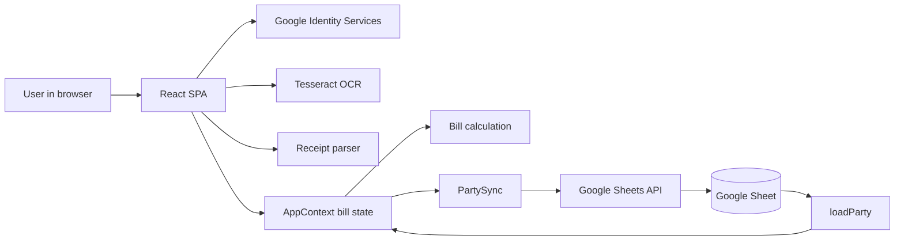
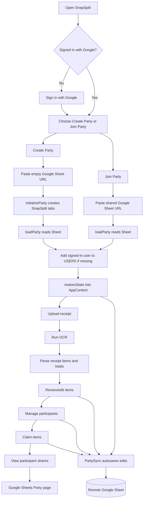
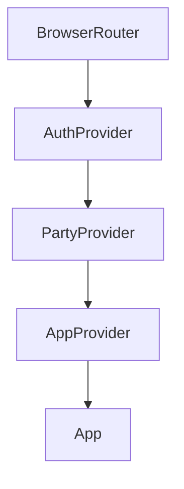
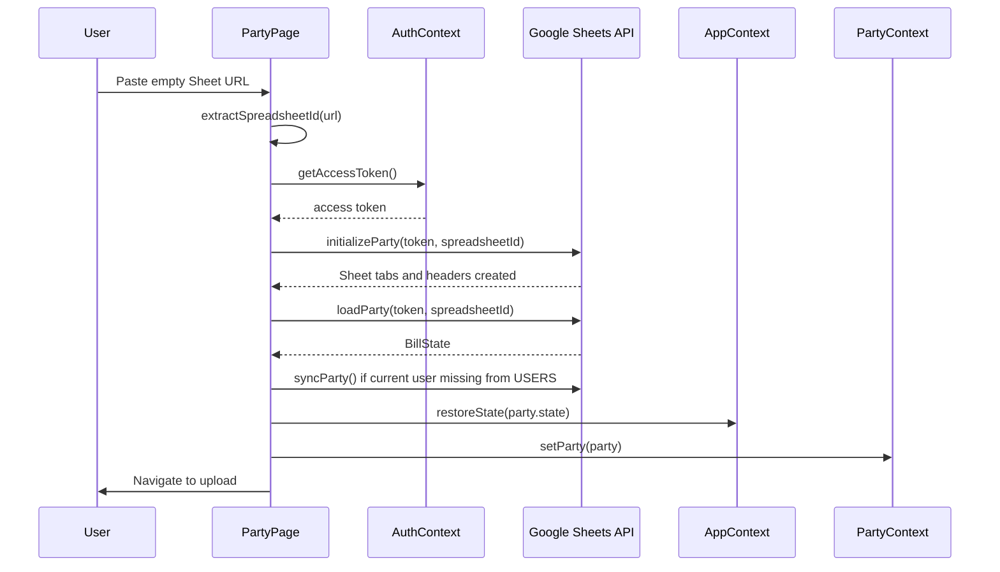
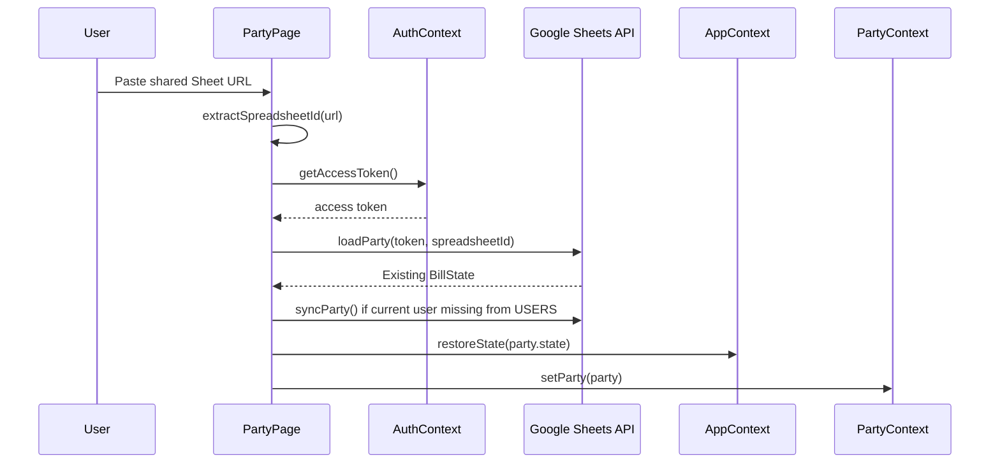
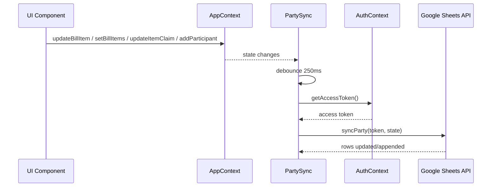
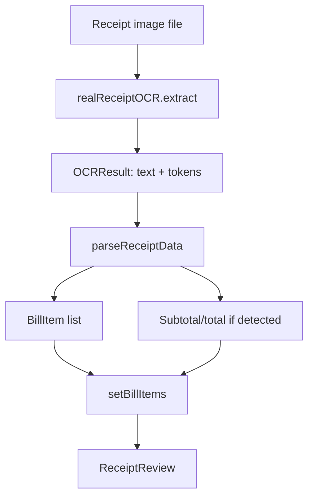

# SnapSplit Application Documentation

SnapSplit is a backendless React + TypeScript web app for splitting a restaurant receipt. The app runs entirely in the browser, uses Google Sign-In for identity, and uses a user-owned Google Sheet as the shared party state.

The current implementation is intentionally small: one bill, one shared Google Sheet, browser-local state while the app is open, and row-level persistence to Google Sheets.

## 1. High-Level Architecture



There is no SnapSplit backend. Google provides both identity and persistence:

- Google OAuth identifies the user and grants Sheets API access.
- Google Sheets stores the party data.
- React context stores the live in-browser bill state.
- `PartySync` watches local state and writes changes back to the remote Sheet.

## 2. Current Product Flow



The party screen appears before receipt upload. This matters because shared persistence is established first; bill edits made after that point can be saved to the party Sheet.

## 3. State Model

The main app state is `BillState` from `src/bill/models.ts`.

```ts
type BillState = {
  receiptItems: BillItem[];
  receiptSubtotal?: number;
  receiptTotal?: number;
  participants: Participant[];
  itemClaims: ItemClaim[];
};
```

Important domain types:

- `BillItem`: one receipt line item with `id`, `name`, `quantity`, `unitPrice`, and `totalPrice`.
- `Participant`: one person in the bill with `id` and `name`.
- `ItemClaim`: how an item is assigned, either individually by quantity or shared equally among selected participants.
- `BillCalculationResult`: calculated totals, tax, participant summaries, and settlement lines.

## 4. Google Sheet Data Model

A SnapSplit party is represented by one Google spreadsheet with four tabs:

| Tab | Purpose | Columns |
| --- | --- | --- |
| `META` | Schema and party metadata | `key`, `value` |
| `USERS` | Participants | `user_id`, `name` |
| `ITEMS` | Receipt items | `item_id`, `name`, `quantity`, `unit_price`, `total_price` |
| `CLAIMS` | Item claims | `item_id`, `user_id`, `quantity`, `mode` |

The current schema version is `1`, stored in `META` as:

```text
schema_version | 1
currency       | INR
created_at     | ISO timestamp
```

The spreadsheet ID comes from a Google Sheets URL like:

```text
https://docs.google.com/spreadsheets/d/<spreadsheet-id>/...
```

## 5. Authentication and Authorization

Authentication code lives in `src/google/auth.ts`.

The OAuth client ID is read from Vite environment config:

```ts
export const GOOGLE_CLIENT_ID = import.meta.env.VITE_GOOGLE_CLIENT_ID || '';
```

Only a public OAuth client ID is used. There is no client secret in the browser app.

The app requests this Sheets scope:

```text
https://www.googleapis.com/auth/spreadsheets
```

Google Sheet sharing is not managed by SnapSplit. Users must configure sharing in Google Sheets. If a participant cannot access a Sheet, the Sheets API returns an access error and the app shows a friendly message.

## 6. Module Map

```text
src/
  App.tsx                    Route shell, navigation, auth controls, party gate
  main.tsx                   React bootstrap and provider composition

  context/
    AppContext.tsx           Live bill state and state mutation functions
    AuthContext.tsx          Google sign-in and token access
    PartyContext.tsx         Current connected Sheet-backed party

  google/
    auth.ts                  Google Identity Services and OAuth token handling
    party.ts                 Sheet schema, load, initialize, and sync operations

  receipt/
    models.ts                Receipt, OCR, and bill item types
    ocr.ts                   Tesseract OCR implementation and mock OCR
    parser.ts                Receipt text/token parser

  bill/
    models.ts                Bill, participant, claim, settlement types
    claims.ts                Claim helpers and default claim construction
    splitting.ts             Item splitting helpers
    settlement.ts            Per-participant bill calculation

  routes/
    PartyPage.tsx            Create/join/refresh party screen
    ReceiptUploadPage.tsx    Route wrapper for receipt upload
    ReceiptReviewPage.tsx    Route wrapper for receipt review
    ParticipantsPage.tsx     Route wrapper for participant management
    ItemClaimPage.tsx        Route wrapper for item claiming
    SettlementPage.tsx       Route wrapper for bill result
    SheetExportPage.tsx      Route wrapper for Sheet status

  components/
    PartySync.tsx            Debounced autosync from AppContext to Google Sheet
    ReceiptUpload.tsx        Upload image, run OCR, parse receipt
    ReceiptReview.tsx        Edit parsed receipt items
    Participants.tsx         Add/remove people
    ItemClaim.tsx            Individual/shared item claiming UI
    Settlement.tsx           Show calculated participant shares
    SheetExport.tsx          Show current Google Sheet party connection

  tests/
    *.test.ts                Unit tests for parsing, claims, splitting, settlement
```

## 7. Provider and Routing Structure

`src/main.tsx` composes the app providers:



Provider responsibilities:

- `AuthProvider` owns Google user state and access tokens.
- `PartyProvider` owns the currently connected party, if any.
- `AppProvider` owns live bill state and exposes mutation functions.

`src/App.tsx` gates the workflow:

- If no party is connected, `/` renders `PartyPage`.
- If a party is connected, `/` renders `ReceiptUploadPage`.
- Workflow routes are shown in navigation only after a party is open.
- `/party` is always available so users can create, join, refresh, or view the current party.

## 8. Key Functions by Module

### `src/google/auth.ts`

`requestGoogleSignIn()`

Loads Google Identity Services, prompts the user to sign in, parses the returned ID token, and resolves a `GoogleUser`.

`requestGoogleAccessToken()`

Creates a Google OAuth token client and requests an access token for the Sheets API scope.

`revokeGoogleAccessToken(token)`

Revokes the current OAuth token during sign-out.

`parseJwt(jwt)`

Decodes the Google ID token payload so the app can read user identity fields like `sub`, `name`, `email`, and `picture`.

`ensureIdClient()`

Initializes the Google Sign-In client. It validates that `VITE_GOOGLE_CLIENT_ID` is configured.

`ensureOAuthClient()`

Initializes the OAuth token client used for Sheets API access.

### `src/google/party.ts`

`extractSpreadsheetId(url)`

Parses a Google Sheets URL and extracts the spreadsheet ID. Returns `null` for unsupported or malformed URLs.

`initializeParty(token, spreadsheetId)`

Turns a pristine empty Google Sheet into a SnapSplit party:

- Reads spreadsheet metadata.
- If the Sheet already has valid SnapSplit `META` schema version `1`, returns without changing it.
- Refuses to initialize non-empty or unfamiliar spreadsheets.
- Renames `Sheet1` to `META`.
- Adds `USERS`, `ITEMS`, and `CLAIMS`.
- Writes headers and metadata.

`loadParty(token, spreadsheetId)`

Reads a SnapSplit Sheet and reconstructs `BillState`:

- Validates required tabs exist.
- Validates `META.schema_version` is `1`.
- Reads `USERS`, `ITEMS`, and `CLAIMS`.
- Converts Sheet rows into participants, receipt items, and item claims.

`syncParty(token, party)`

Writes current app state to the remote Google Sheet:

- Upserts participant rows into `USERS`.
- Upserts item rows into `ITEMS`.
- Upserts claim rows into `CLAIMS`.
- Uses row keys so unchanged rows are skipped.

`syncRows(token, id, sheet, keyIndexes, desired)`

Shared helper used by `syncParty`. It reads existing rows, builds stable keys, updates rows that changed, and appends rows that do not exist yet.

`request(token, path, options)`

Low-level Sheets API request helper. Adds auth headers, JSON content type, and converts access errors into user-friendly messages.

`metadata(token, id)`

Fetches spreadsheet tab metadata.

`getValues(token, id, range)`

Reads values from a Sheet range.

`batch(token, id, requests)`

Sends a Sheets `batchUpdate` request, used for structural changes like adding tabs.

`update(token, id, range, values)`

Writes values to a specific range.

`append(token, id, range, values)`

Appends rows to a range.

### `src/context/AppContext.tsx`

`addParticipant(name, id?)`

Adds a participant. If an ID is supplied, it uses that ID; otherwise it creates a local `user-<timestamp>` ID. It also adds default zero quantities for the new participant to existing individual claims.

`removeParticipant(participantId)`

Removes a participant and removes that participant from all individual and shared claims.

`setParticipants(participants)`

Replaces the participant list and prunes claims so they only reference active participants.

`restoreState(state)`

Loads a full bill state into React state. Used after `loadParty` reads the Sheet.

`updateBillItem(item)`

Updates an existing receipt item.

`setBillItems(items, totals?)`

Replaces receipt items after OCR/parse or another bulk load. Existing matching claims are preserved, obsolete item claims are removed, and default claims are created for new items.

`addBillItem()`

Creates a new manual receipt item and a default individual claim for it.

`removeBillItem(itemId)`

Removes an item and its claim.

`updateItemClaim(claim)`

Replaces the claim for one item.

`calculationResult`

Memoized result from `calculateBillResults`, recomputed whenever items, participants, claims, subtotal, or total change.

### `src/context/AuthContext.tsx`

`signIn()`

Starts Google sign-in and stores the signed-in user in context.

`getAccessToken()`

Returns a cached token if available, otherwise requests a new Google OAuth token.

`signOut()`

Revokes the access token if present and clears auth state.

### `src/context/PartyContext.tsx`

`setParty(party)`

Stores or clears the currently connected party. A party contains a `spreadsheetId` and the loaded `BillState`.

`usePartyContext()`

Accesses the party context and throws if used outside `PartyProvider`.

### `src/components/PartySync.tsx`

`PartySync()`

Runs as an invisible component mounted by `App`. When a party is connected, it watches `AppContext.state`, waits 250ms after a change, gets an access token, and calls `syncParty`.

The component does not block UI editing if sync fails. It logs the error, leaving the latest edits in local browser state.

### `src/routes/PartyPage.tsx`

`PartyPage()`

Controls the Create Party and Join Party flow:

- Requires Google sign-in.
- Accepts a Google Sheets URL.
- Extracts the spreadsheet ID.
- Calls `initializeParty` only for create mode.
- Calls `loadParty` for both create and join modes.
- Adds the current Google user to the participant list if missing.
- Calls `restoreState` and `setParty`.
- Offers refresh from Sheet for an already connected party.

### `src/receipt/ocr.ts`

`realReceiptOCR.extract(file)`

Runs Tesseract OCR against an uploaded image file and returns OCR text plus word tokens with bounding boxes.

`mockReceiptOCR.extract(file)`

Returns hard-coded sample receipt text after a short delay. This is useful for development or tests if wired in.

`ensureWorkerReady()`

Creates and initializes the Tesseract worker once.

### `src/receipt/parser.ts`

`parseReceiptData(result)`

Main receipt parser. It:

- Splits OCR text into normalized lines.
- Extracts subtotal and total summary lines.
- Finds the item section.
- Parses item rows.
- Falls back to token bounding boxes if line parsing finds no items.

Returns parsed items, subtotal, total, and raw text.

`parseReceiptLines(result)`

Convenience function that returns only parsed receipt items.

`parseItemLine(line)`

Attempts to parse one receipt line into a `BillItem`. It detects quantity, unit price, and total price heuristically.

`findItemSection(lines)`

Tries to find the part of the receipt containing item rows by detecting table headers and stopping at summary rows.

`getSummaryAmount(line)`

Detects subtotal, total, tax, service charge, and similar summary lines.

`groupTokensIntoLines(tokens)`

Uses OCR token bounding boxes to reconstruct text rows when raw OCR text is not useful enough.

### `src/bill/claims.ts`

`getClaimedQuantity(claim, participantId)`

Returns how many units a participant individually claimed for an item.

`getTotalClaimedQuantity(claim)`

Returns the sum of all individual quantities in a claim.

`getRemainingQuantity(item, claim)`

Returns how many units remain unclaimed for an item.

`isClaimValid(item, claim)`

Returns whether claimed quantity is less than or equal to item quantity.

`buildDefaultClaim(item, participantIds)`

Creates a default individual claim with zero quantity for each participant.

### `src/bill/splitting.ts`

`roundToCents(value)`

Currently rounds to the nearest whole number. Despite the name, this behaves like rupee/integer rounding rather than two-decimal cent rounding.

`splitSharedItemEvenly(item, participantIds)`

Splits an item total evenly across selected participants. Any whole-number remainder is assigned to earlier participants in the list.

`calculateIndividualShares(item, claimQuantities)`

Multiplies each participant's claimed quantity by the item unit price.

### `src/bill/settlement.ts`

`calculateBillResults(items, participants, itemClaims, receiptTotals?)`

Calculates the bill summary:

- Builds per-participant item shares.
- Uses shared mode to split items equally among selected participants.
- Uses individual mode to multiply claimed quantities by unit price.
- Computes item subtotal.
- Uses receipt subtotal and total when available.
- Treats `total - subtotal` as tax/extra charges when positive.
- Allocates tax proportionally to each participant's item share.
- Returns participant summaries.

`settlements` is currently returned as an empty array. The app shows participant shares, but it does not yet compute payment transfer recommendations.

## 9. Detailed Data Flow

### Creating a Party



### Joining a Party



### Editing and Autosaving



## 10. Receipt Processing Flow



OCR is currently powered by `tesseract.js`, even though the original product spec mentions PaddleOCR.js / ONNX Runtime Web.

## 11. Calculation Rules

For each item:

- If claim mode is `shared`, the item total is split evenly among selected participants.
- If claim mode is `individual`, each participant pays `claimedQuantity * unitPrice`.
- If receipt total is greater than receipt subtotal, the difference is treated as tax/extra charge.
- Tax is allocated proportionally based on pre-tax participant shares.

Example:

```text
Item subtotal: INR 900
Receipt total: INR 990
Tax/extra: INR 90

Participant A item share: INR 300
Participant B item share: INR 600

A tax share: INR 30
B tax share: INR 60
```

## 12. Persistence Behavior

Remote persistence is done through `PartySync` and `syncParty`.

What is saved:

- Participants
- Receipt items
- Item claims

What is loaded:

- Participants
- Receipt items
- Item claims

Current important limitation:

- `receiptSubtotal` and `receiptTotal` are part of local `BillState`, but the current Sheet schema does not persist them. After a reload from Sheet, `loadParty` reconstructs items, participants, and claims, but not the parsed receipt subtotal/total.
- `syncRows` updates and appends rows, but it does not currently delete stale remote rows when local items, participants, or claims are removed.
- `settlements` are not calculated yet; participant shares are calculated.

## 13. Development Commands

From the project root:

```bash
npm run dev
npm run build
npm test
```

Because this workspace is used from WSL, run these commands inside WSL from the Linux-mounted project path when possible:

```bash
cd /mnt/c/Projects/SnapSplit
npm run dev
```

Required environment variable:

```text
VITE_GOOGLE_CLIENT_ID=<your Google OAuth client ID>
```

## 14. Testing Overview

The project uses Vitest. Existing tests cover core parsing and bill logic:

- `src/tests/parser.test.ts`
- `src/tests/claims.test.ts`
- `src/tests/splitting.test.ts`
- `src/tests/settlement.test.ts`

Recommended future test additions:

- `extractSpreadsheetId` URL parsing tests.
- `loadParty` Sheet row conversion tests.
- `syncParty` row generation tests.
- Party create/join UI tests with mocked Google APIs.
- Persistence tests for subtotal/total once the Sheet schema stores those values.

## 15. Known Gaps and Next Engineering Targets

These are not bugs in this document; they are the current implementation boundaries worth knowing:

- No SnapSplit backend or database.
- No local `.xlsx` file loading.
- No automatic Google Sheet creation.
- No Drive permission management.
- No realtime multi-user conflict handling.
- No stale-row deletion in Google Sheets sync.
- No Sheet persistence for receipt subtotal/total.
- No settlement transfer optimization yet.
- OCR implementation uses Tesseract, while the product spec references PaddleOCR.js.

The most valuable next hardening work would be to persist subtotal/total in `META` or a dedicated totals tab, add stale-row deletion, and add tests for the Google Sheet adapter.
